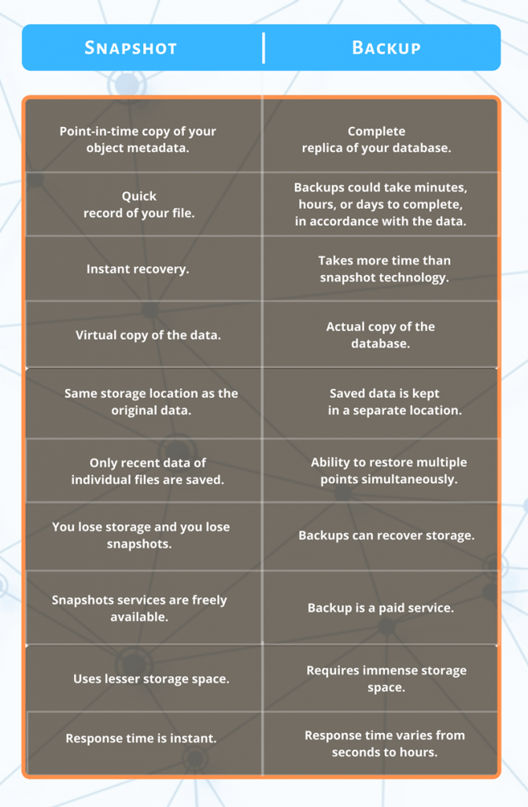

# SQL Server

## Log locations
```
/var/opt/mssql/data/master.mdf
/var/opt/mssql/data/mastlog.ldf
/var/opt/mssql/log/errorlog
```

## Connection Strings

### [Timeouts](https://docs.microsoft.com/en-us/dotnet/api/system.data.sqlclient.sqlconnection.connectiontimeout?view=dotnet-plat-ext-5.0)
- `Connect Timeout` and `Connection Timeout` are the same property
  - `Gets the time to wait (in seconds) while trying to establish a connection before terminating the attempt and generating an error.`
- default is 15 seconds in some libraries
- when set to 0, the connection is set to wait indefinitely
  - this is not the case for all libraries however
  - `System.Data.SqlClient` version `4.8.x` implements this but version `4.7.0` times out immediately

## SQL Server With Docker

### EULAs
- the env var `ACCEPT_EULA` needs to be set to `Y` when installing the sql server docker container or installing `mssql-tools`, otherwise you will need an interactive terminal to accept it

## Snapshots
- creates a read only version of the db at the time of creation
- you can only create one from what I know
- comparison with backups \

- creating
    ```sql
    create database snapshot_name on
    (
        name = name_of_db,
        filename = '/some/path/and/file_name'
    )
    as snapshot OF name_of_db
    ```
    - this is pretty much instant, but every time a page is "dirtied" after the snapshot is created, a copy of it is made
- deleting
    ```sql
    drop database if exists snapshot_name
    ```
- restoring
    ```sql
    restore database name_of_db
    from database_snapshot = snapshot_name
    ```
    - this requires that no other open connections to the database exist
    - if there are, this will wait for those connections to close, but timeout at 20sec and fail
      - be warry of sql connection pooling
    - if you need the connection to be forceably closed when you restore, wrap your restore statement in this
        ```sql
        alter database name_of_db set single_user with rollback immediate

        -- your restore code

        alter database name_of_db set multi_user
        ```
    - the performance of restore scales with the number of pages you "dirty" since creating the snapshot
    - unoptimized, even without "dirtying" pages, the snapshots seem to take 1.5sec each
- snapshots can be optimized a [few ways](https://dba.stackexchange.com/questions/179695/fastest-way-to-restore-a-sql-server-database)

## Instant file initialization
- to save time from zeroing out files on creation (which can greatly speed up operations like snapshots), you can disable the zeroing by turning on instant file initialization
- this is a security risk because the process would be able to see the data that was previously allocated in that area
- to enable this on a windows environment, you need to give sql server certain permissions in the OS
- this doesn't seem to be well supported on its docker container environment though